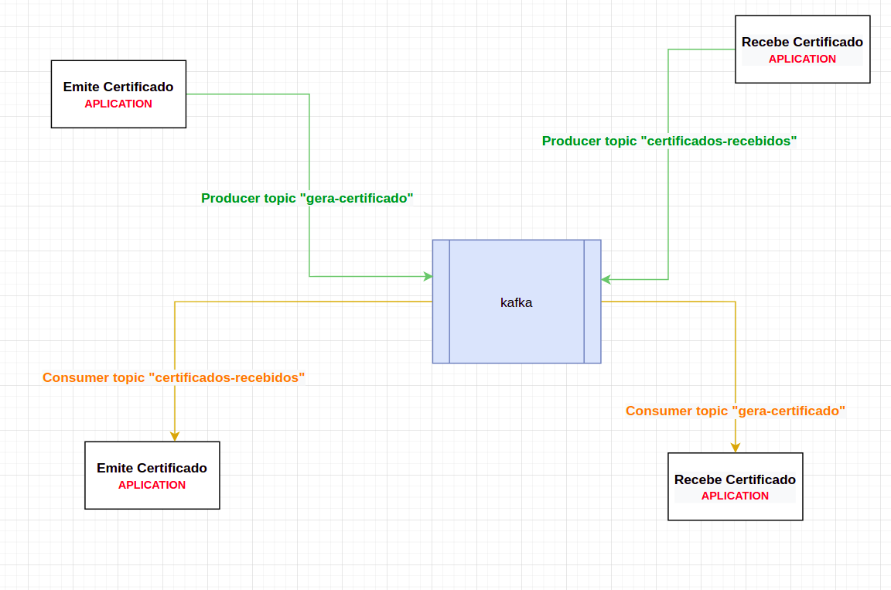

# Micro Serviço de Messangeria com Node.js e Apache Kafka



## Tecnologias

- Kafka
- Node
- Docker

## Aplicações

- api-emite-certificado
- api-recebe-certificado

## Fluxo

- A API "emite-certificado" ao iniciar a aplicação ela faz uma incrição no kafka para consumir o tópico "certificados-recebidos" que é um tópico produzido pela API "recebe-certificado", que retorna uma mensagem quando a API "emite-certificado" produz uma mensagem no tópico "gera-certificado" enviando os dados do usuário e o curso no qual está sendo gerado o certificado, feito isso ela retorna uma mensagem com os dados do usuário.


# Como rodar a aplicação

## Requisitos necessários

- Ter o node na última versão instalada.
- Ter o Docker instalado em sua máquina.

**Subir o containers do docker**

```
docker-composer up -d
```

**Acessar o diretório da /api-emite-certificado por uma janela do terminal e rodar os comandos abaixo:**

**Instalar as dependências do projeto**

```
npm install
```

**Rodar a aplicação**

```
npm run dev
```

**Acessar o diretório da /api-recebe-certificado por uma janela do terminal e rodar os comandos abaixo:**

**Instalar as dependências do projeto**

```
npm install
```

**Rodar a aplicação**

```
npm run dev
```

**Importar a collection do postman e fazer a requisição**
